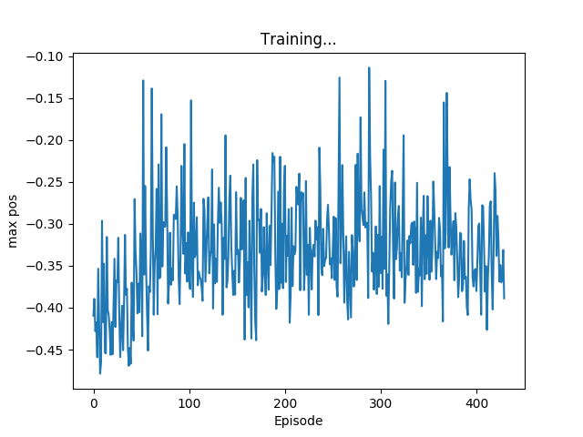

# Driving a car on a hill with machine learning

Figure 1 Visual representation of the learning task. The cart has to reach the flag.

# Introduction

In this report we will discuss a machine learning algorithm. The task of the algorithm is to drive a car to the top of mountain hill, but its engine is too weak to drive directly on the hill, it must build op momentum by driving forward and backward.

This report will first go through the environment (dataset), then discuss the algorithm and its results and finally the conclusions and recommendations

# Environment

The chosen environment is the MountainCar-v0 by OpenAIs Gym[CITATION Mou18 \l 1033]. This environment has a car that is placed in a valley (between two mountains).  The mountains are created by a sine wave between x = -1.2 and x = 0.6. The car spawns between x = -0.6 and x = -0.4. This is visualized in figure 1. The robot is controlled by three commands, a 0 for driving backwards, a 1 for doing nothing and a 2 for driving forward. That means that this problem is classification problem. The goal is to drive the car to x = 0.5. The car is not powerful enough to drive directly to the top of the hill, therefore it must drive forwards and backwards to build op momentum. The car doesn&#39;t experience friction.

After the car has been controlled by on of thee commands the environment returns the state of the car, existing of position and velocity, the reward and a done Boolean. If the done Boolean is true the car has reached the top of the hill or the episode has taken longer than 200 steps. The reward is always -1. This means that the reward will always be the same until the car has reached the top.

# The algorithm

Since this problem doesn&#39;t have targets but only a goal that must be achieved on a most optimal way this problem is a Reinforcement learning problem.  This means that the algorithm will be a Neural Network since this isn&#39;t a linear problem. The neural network has three outputs, so it can be used for classification. It uses two layers with ReLU and softmax activation functions respectively and with 200 hidden nodes. This was adopted by other reinforcement algorithms found[CITATION Pyt18 \l 1033] and changing them either didn&#39;t give a noticeable difference or a worse result, so they weren&#39;t changed. To receive a classification result the three output are seen as probabilities. So, the first output returns the change the action will be to drive backwards, the second to do nothing and the third to drive forward. The output with the highest probability is chosen. The Adam optimization function is used since it&#39;s the most optimal one according to literature[CITATION Apo17 \l 1033].

The learning rate is set at 0.01 and has been found by trial and error. This learning rate seams (very close to) the optimal learning rate since the algorithm learns fast and lowering it doesn&#39;t create better results. The maximum iterations aren&#39;t fixed since it can take a while before the algorithm learns something, as will be explained below, but a maximum of 1000 iterations should give some result most of the times.

As explained above the reward is -1 for every action the environment takes. This means that the reward is always -200 (because the environment only runs for a maximum of 200 steps) until the car reaches the top, because then the number of steps is lower van 200. This means that the algorithm keeps randomly guessing its weights. The problem is that the algorithm never gets the car to the top of the hill, so the reward is always the same and the algorithm doesn&#39;t really learn. To make the algorithm learn the closest position the car has gotten in the episode is added to the reward. Because the normal reward is relatively big in comparison with the position (-200 vs -0.5) you might think that the reward based on the position should be made bigger, but by trial and error the opposite was found. This is good because once the car has reached the goal the goal of the algorithm is to optimize this process and not to get further.

# The result

Figure 2 Result

As shown in figure 2 the algorithm isn&#39;t able to reach the top of the mountain (flag position is 0.5). It&#39;s clearly visible that the algorithm learns, since the average maximum position is clearly increasing after about 50 episodes but stops at 100 episodes. Other weight initializations show that this window can also happen way later, even after more than 1000 episodes.

It&#39;s not directly clear why this is. There are different examples of reinforcement learning that use the same neural network[CITATION Pyt18 \l 1033] and the algorithm does clearly learn, only it seems to stop learning to early. This might be because it has found a local minimum. To check this the following actions have been taken to find a better, or even the global, minimum, but didn&#39;t have success:

- Adjusting the learning rate
- Adjusting the reward:
  - Magnifying the max position reward
  - Add a reward for higher velocities
  - Add a reward for greater distances travel (since the car needs to travel more distance to build op speed)
- Changing the Neural Network:
  - Adjusting the amount of hidden nodes
  - Adjusting the amount of output to one (so that when 0\&lt;x\&lt;1/3 means driving backwards and 1/3\&lt;x\&lt;2/3 means standing still and x\&gt;2/3 means driving forward)
  - Adjusting the activation and optimization functions

# How to improve

Others have had more luck designing a machine learning algorithm for this specific task. They mostly used Q-learning[CITATION ts118 \l 1033] or SARSA and TileCoding[CITATION Zhi19 \l 1033]. I didn&#39;t use those methods from the start because I thought the reinforcement learning algorithm based on methods I already knew from the course would work. I wasn&#39;t able to understand these newer methods fully and didn&#39;t just want to copy someone else&#39;s code. As far as my understanding of these methods goes is that they take the previous action in consideration when calculating a new action. This might be why my Neural Network didn&#39;t work, this would surprise me however, because the current velocity and position of the car should be enough to decide the next action (when velocity is approaching 0, turn around).

# Conclusion and Recommendations

A machine learning algorithm has been created that can drive a cart almost halfway up a hill. Where the goal was to drive it all the way up a hill. To improve the algorithm it is worth it to look at Q-learning or SARSA and LileCoding, since others had more luck using that approach.

# Sources
| [1] | „MountainCar-v0 Gym Environment,&quot; OpenAI, 2018. [Online]. Available: https://gym.openai.com/envs/MountainCar-v0/. [Geopend 2019]. |
| [2] | „Pytorch reinforcement example,&quot; Pytorch, 2018. [Online]. Available: https://github.com/pytorch/examples/blob/master/reinforcement\_learning/reinforce.py. [Geopend 2019]. |
| [3] | A. Agrawal, „Loss Functions and Optimization Algorithms. Demystified.,&quot; Medium, 29 September 2017. [Online]. Available: https://medium.com/data-science-group-iitr/loss-functions-and-optimization-algorithms-demystified-bb92daff331c. [Geopend 2019]. |
| [4] | ts1829, „Mountain Car v0 - Q Learning,&quot; 2018. [Online]. Available: https://gist.github.com/ts1829/244d36ea4aac872f1c3a82d3b481a99c#file-mountain-car-v0-q-learning-ipynb. [Geopend 2019]. |
| [5] | ZhiqingXiao, „Solve MoutainCar-v0 using SARSA() + TileCoding,&quot; 2019. [Online]. Available: https://github.com/ZhiqingXiao/OpenAIGymSolution/blob/master/MountainCar-v0/mountaincar\_v0\_sarsa\_lambda\_tilecode.ipynb. [Geopend 2019]. |

